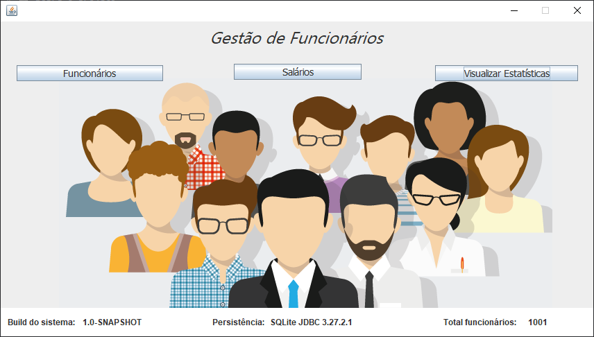
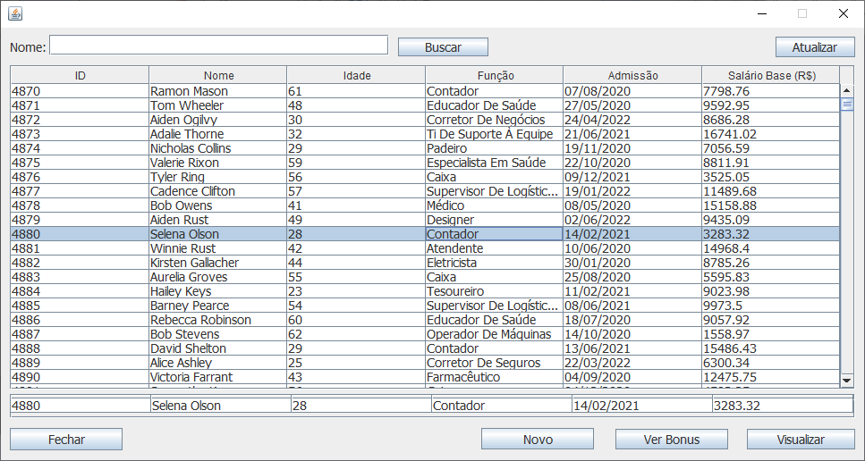
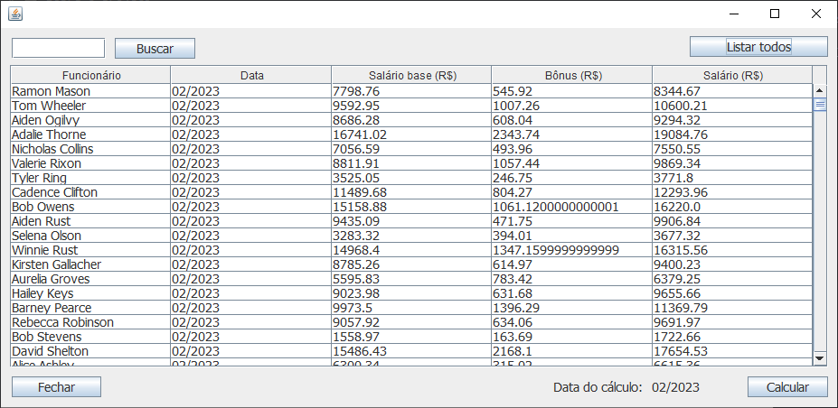
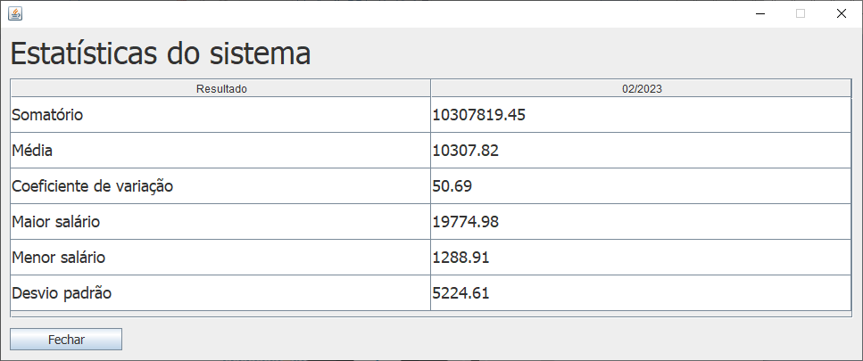

<h1 align="center"> Sistema Gestão de Funcionários </h1>

  

 Projeto desenvolvido com Java e sqlite.
 

  <a href="#-sobre-o-projeto">Sobre o projeto</a>&nbsp;&nbsp;&nbsp;|&nbsp;&nbsp;&nbsp; 
  <a href="#-layouts">Layouts</a>&nbsp;&nbsp;&nbsp;|&nbsp;&nbsp;&nbsp;
  <a href="#-requisitos-e-recomendações">Requisitos e recomendações</a>&nbsp;&nbsp;&nbsp;&nbsp;&nbsp;&nbsp;

</img>

# 💻 Sobre o projeto 

 Projeto criado para a matéria - Projetos de software. O intuito é desenvolver um sistema de funcionários segundo os requisitos solicitados (Manter Funcionários, Calcular Salários, Calcular Bonus, Visualizar Estatísticas de Salários, etc). O objetivo é desenvolver segundo todos os princípíos de projetos de software (Criacionais, Estruturais e Comportamentais). Os requisitos solicitados pelo professor estão em anexo: 

<a href="https://docs.google.com/document/d/1-RICqFRX-szya4V859hsd3a73bKk5rvTixH9WMRx0m8/edit"> Requisitos para o trabalho</a>

  

# 📸 Layouts 

<h3 align="center">Tela inicial do sistema</h3>

</img>

 
<h3 align="center">Tela de controle de funcionários</h3>

</img>
 
 
<h3 align="center">Tela de cálculo de salário para o mês atual (acrescido dos bônus ganhos no mês)</h3>

</img>
 
 
<h3 align="center">Tela de visualização de cálculos estatísticos referêntes à cada mês de salário calculado</h3>

</img>
 

  

# 📝 Requisitos e recomendações

PARA QUE O PROJETO FUNCIONE:  
1.1- 	Importe o projeto no netbeans, clique com o segundo botão do mouse no projeto e clique em "construir com dependências".  
1.2- 	Importe o projeto no eclipse, clique com o segundo botão do mouse no projeto e clique em "maven"->"update project".  
2-	    Execute o App.java do projeto.  

REQUISITOS:
- Java 11 ou superior.

OBS: 
- Caso queira, pode carregar o arquivo de salários disponibilizado pelo professor da matéria para popular o banco. O arquivo está na pasta principal do projeto e está limitado à apenas 1000 registros.
- Ao insirir a data de contrato de um novo funcionário em "registrar novos funcionários" o formato aceito é somente: dd/mm/aaaa (não utilizar outro).

  

# ✒️ Autor

Yves Lima Silva

<a href="https://www.linkedin.com/in/yves-lima-b63b2515b/"> Linkedin </a>
